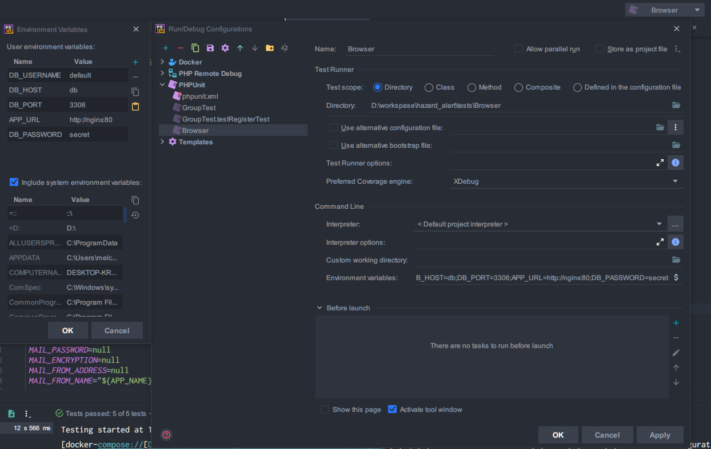

# Docker を使ったリスク通知システムの環境構築

`Docker` および､ `Docker Compose` をインストールしてください｡  

## 環境構築設定ファイル

`docker/.env.example` をコピーして､ `.env` にリネームしてください｡  

```bash
$ cp docker/.env.example docker/.env
```

内容を確認して､必要があれば各設定を変更してください｡  
基本的に変更は不要です｡  

## コンテナを立ち上げる

コンテナをビルドして立ち上げます｡  

```bash
$ cd docker
$ docker-compose up -d build
```

### 各コンテナ接続情報

- `nignx`
  - `https://localhost`
  - `http://localhost:8080`
- `db`
  - DB 名 (dev) : app
  - DB 名 (test) : app-test
  - ポート: 3306
  - ユーザー: default
  - ユーザー: secret
  - root パスワード: root
- `phpmyadmin`
  - `http://localhost:8000`

## アプリケーションの設定

`startup.sh` を実行
アプリケーションの設定ファイル (.env) を作成､ライブラリのインストール､テストを実行します｡  

```bash
$ docker-compose exec php sh docker/startup.sh
```

以下に `docker/startup.sh` で実行される処理を記します｡  

### アプリケーション設定ファイル作成

すべて `.env.dusk.testing` を元に作成されます｡  

- `.env`
- `.env.testing`
- `.env.dusk.develop`

### 各種ライブラリのインストール

`composer install` と `npm install && npm run dev` を実行します｡  

### `APP_KEY` を生成

作成した設定ファイルに `APP_KEY` を設定します｡  

### マイグレーションを実行

`.env` を元に､マイグレーションを実行します｡  

### 各種テストを実行

ブラウザテストおよび､ `Feature` ､ `Unit` テストを実行します｡  

## PhpStorm 向け

### PHPUnit 

PhpStorm 付属の PHPUnit プラグインを利用する場合､そのまま実行してしまうと､ `.env` を参照してしまうので､以下の画像を参考に､必要な設定値を上書きしてください｡  
※ 以下の設定は `tests/Browser` 全体のみ有効

`Run > Edit Configurations...`  
`Command Line > Environment variables`  




